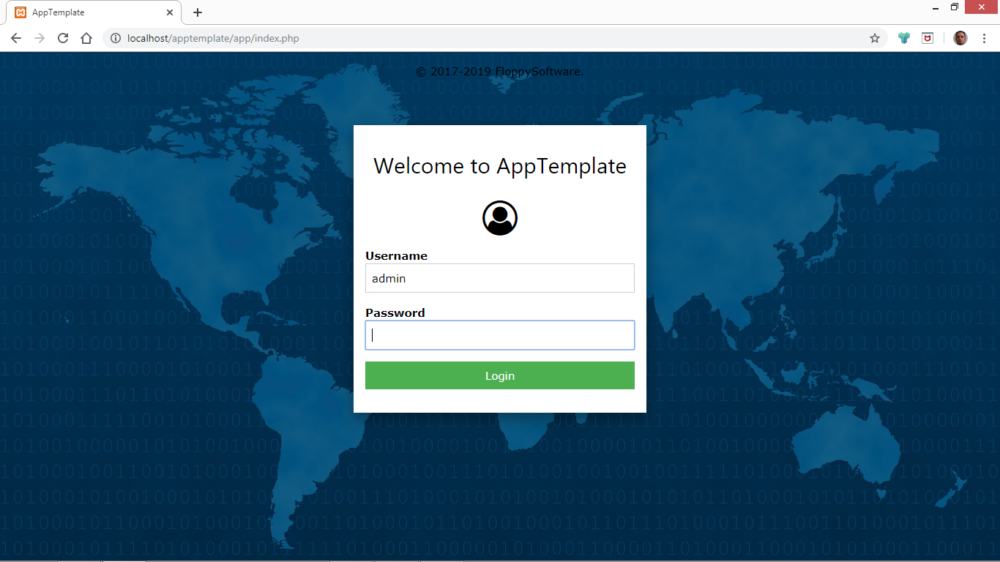
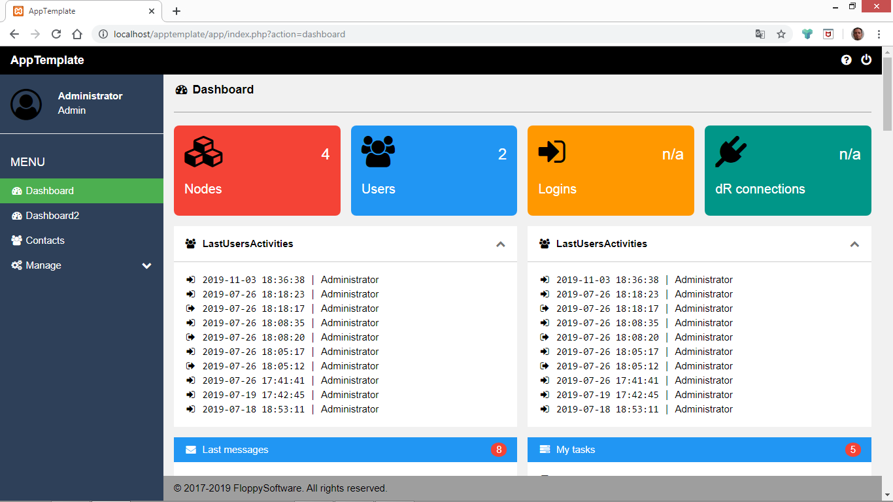
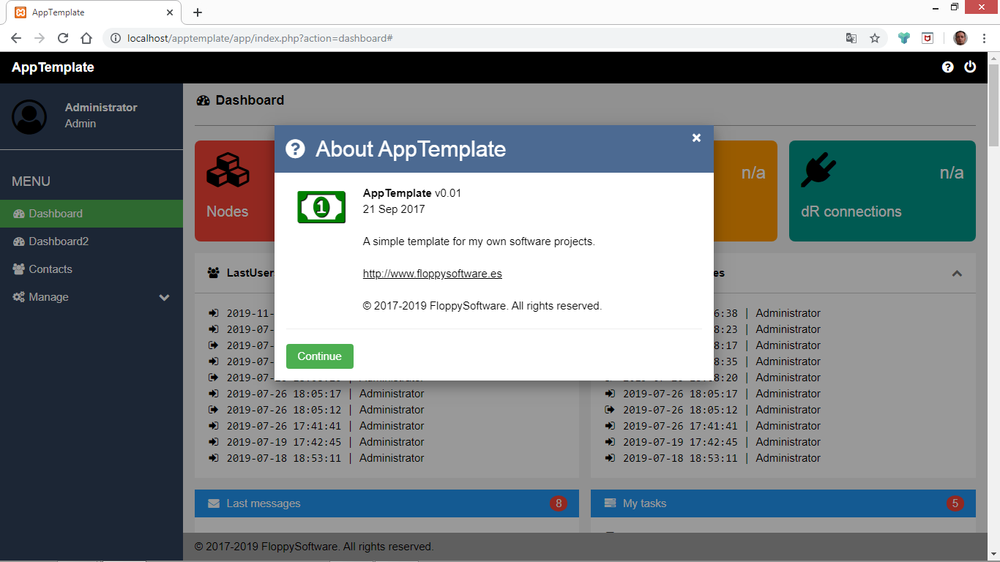
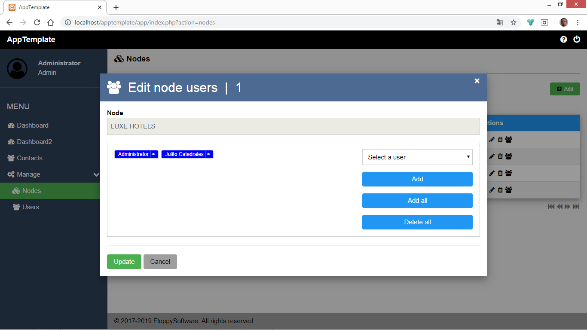
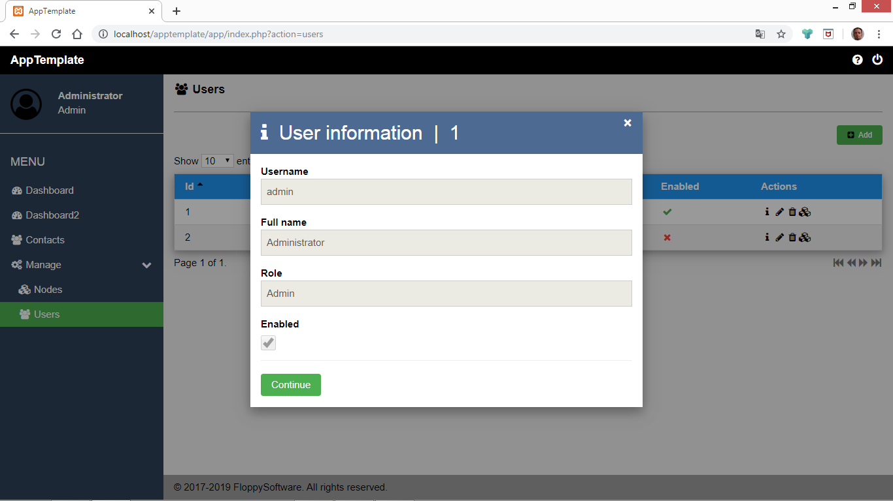

# AppTemplate

## What is AppTemplate?

**AppTemplate** is my template for PHP + MySQL + JavaScript + HTML5 + CSS3 projects.

It is a sort of minimal and simple framework for web applications, where a big framework is not really needed.

A special characteristic of AppTemplate is that it is (or it can be) multi tenant.

**CAUTION!** AppTemplate is a **Work In Progress** and I use it for my projects. I mean: maybe it does not fit
your requirements, and could be totally unstable and / or partially implemented (in fact **it is**).

Use it at your own risk. No warranty of any kind is provided.



## What technology does AppTemplate use?

MyTreasure is written with the following computer languages:

- **PHP** as server language.
- **HTML5** and **CSS3** for the web views.
- **MySQL** to store the database.
- and a bit of **JavaScript** to glue some things.

It uses the [W3.CSS framework](https://www.w3schools.com/w3css/) and [Font Awesome](http://fontawesome.io/) for the icons.

The background image comes from [pixabay.com](https://pixabay.com/es/illustrations/%C3%A1frica-am%C3%A9rica-asia-atl%C3%A1ntico-15428/) by paulina, November 9, 2016.

It uses also some libraries I have developed:

- NiceTable: for web tables.
- NiceGraph: for bar graphics.
- NiceTags: for tags.

They are already used in AppTemplate, so you can see how they work.

## What I need to run AppTemplate in my computer?

As AppTemplate is an application which uses web technologies to do its job and MySQL to store data, you will need the following to run it in your personal computer:

- A web server with support of the PHP language (version 5.x or higher). The Apache web server, for example.
- A MySQL or compatible database server. Your choice could be MySQL or MariaDB.
- A web browser with the JavaScript language enabled.

To develop (and run) AppTemplate in my personal computer I use [XAMPP](https://www.apachefriends.org/es/index.html), which includes the two first requirements (web server, PHP, MySQL).

## Can I install AppTemplate as a conventional web application?

Yes, of course. AppTemplate **is** a web application.

## What I need to do to install AppTemplate in my personal computer?

You must do the following:

- First of all: install a web server with PHP support and a MySQL or compatible database server on your computer if you need to do so.
- Create a database called `app_template` by running the script `app_template.sql` in your database server. For example:
```
mysql -u root -p < app_template.sql
```
- Download AppTemplate and place it in a directory inside the XAMPP htdocs directory (or equivalent for your web server). In my personal computer that directory is: `C:\xampp\htdocs\apptemplate\`.
- Configure the file `conf.php` located in `apptemplate\app\libs` to meet your language and database requirements. Leave the rest of the file as is.

Currently, you can set `es` for Español (Spanish) or `en` for English.
```php
$CF['app_language']  = 'es';
```
My database configuration looks like this:
```php
$CF['db_server']     = 'localhost';
$CF['db_name']       = 'app_template';
$CF['db_user']       = 'root';
$CF['db_password']   = '';
```

## Once installed, how can I run AppTemplate?

- Run the web and database servers.
- Open your web browser and type the following as the url: `http:\\localhost\apptemplate\`.
- Enter your username and password. By default, there one user:
  - `admin`, with password: `admin`.

It is advisable to adjust the zoom of the web browser, for a better user experience.

## Who is the author?

It's **me**. ;)

My name is Miguel García, I'm a software developer from Valencia, Spain.

Developing software it's not just my job. It's vocational, because I **love** computer programming since 1988 or so.

You can contact me at the following addresses:

[www.floppysoftware.es](http://www.floppysoftware.es)
floppysoftware@gmailcom

## Can I contribute to AppTemplate?

Yes, your feedback and suggestions are always welcomed.

And maybe a UI translation?

## License

MyTreasure is (c) 2017-2019 Miguel García / FloppySoftware.

Released under the GNU General Public License v3.

See the file LICENSE.md for more details.

## More screenshots





